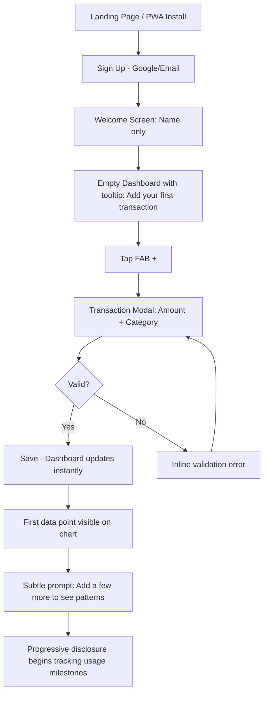
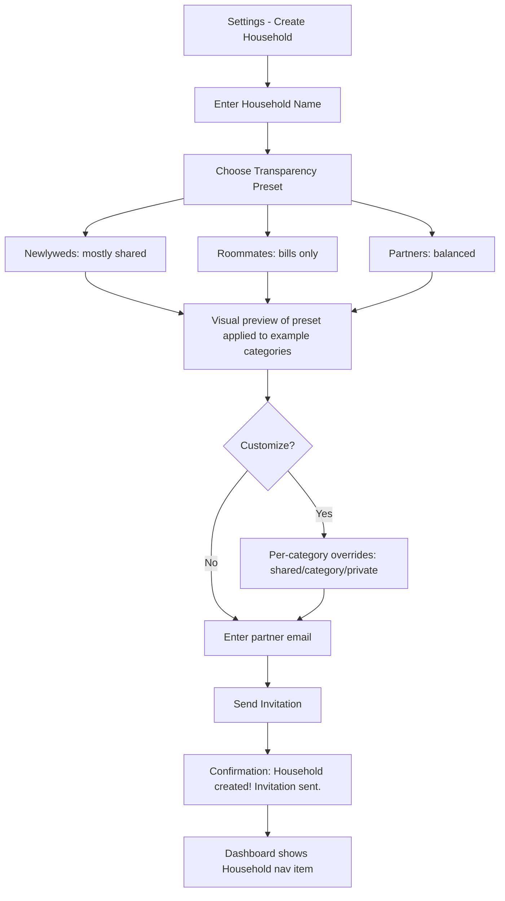
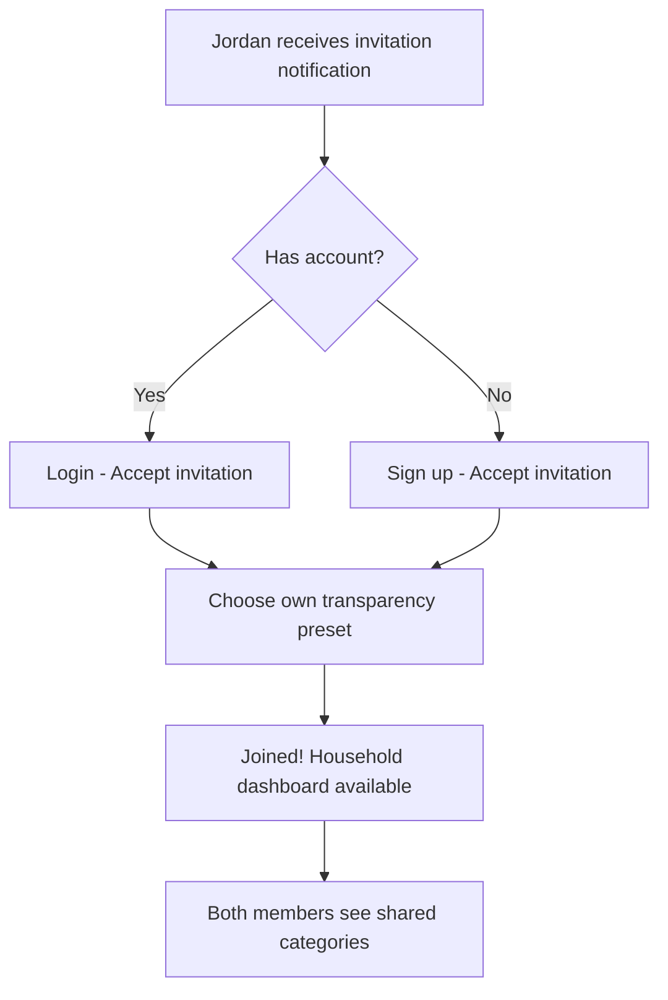
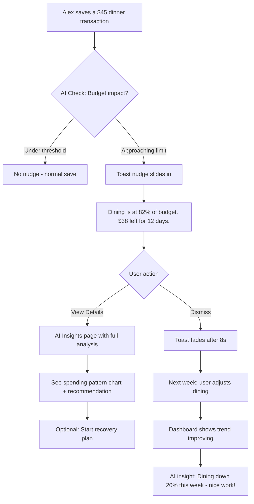
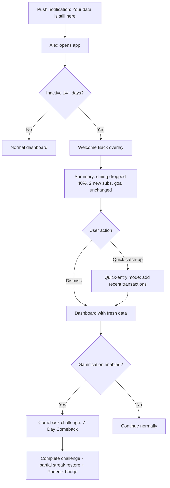
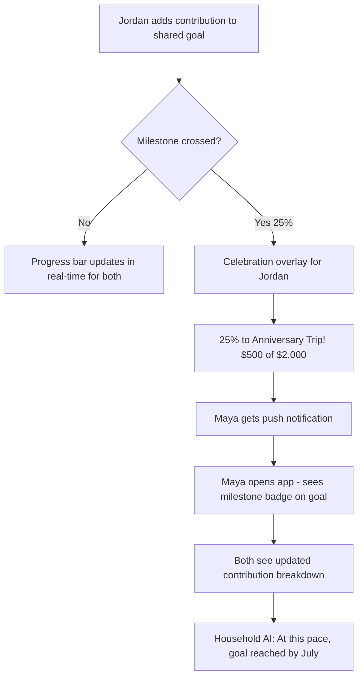

# UX Design Specification Smart-Budget-Application

**Author:** Nikit
**Date:** 2026-03-25

---

<!-- UX design content will be appended sequentially through collaborative workflow steps -->

## Executive Summary

### Project Vision

Smart Budget Application Phase 2 evolves from a personal finance tracker into an intelligent household financial operating system. Three interconnected UX pillars drive this evolution: AI Financial Intelligence (proactive coaching), Household Collaboration (privacy-respecting shared budgets), and Gamification (habit-building engagement). The existing Phase 1 design foundation — Trust Blue theme, Visual Intelligence Dashboard, Chakra UI, sub-30-second transaction entry — must be preserved and extended, not replaced.

### Target Users

1. **Solo Power Users** — Existing users who want smarter insights, spending visualizations, and savings goal tracking beyond basic transaction logging
2. **Household Partners/Couples** — Partners sharing finances who need privacy controls, contribution tracking, and shared goals without awkward conversations
3. **Roommates/Housemates** — Groups splitting bills who need simple shared categories without exposing personal spending
4. **New Users** — First-time budgeters who need zero-friction onboarding and progressive feature discovery
5. **Lapsed Users** — Returning users who need gentle re-engagement with catch-up summaries, not guilt

### Key Design Challenges

1. **Household complexity without friction** — Transparency levels, contribution splits, shared categories, and member management must feel as simple as the existing solo experience. Setup target: under 3 minutes including invitation.
2. **Gamification in a financial context** — Streaks, scores, and badges must motivate without trivializing money management. All gamification opt-in, never blocking core functionality.
3. **Information density management** — Phase 2 adds heatmaps, AI nudges, household dashboards, goals, values views, and achievement displays to an already feature-rich app. Progressive disclosure is critical.
4. **Real-time collaboration UX** — Household members see changes in <500ms while privacy boundaries remain invisible and unbreakable at the data layer.
5. **Emotional tone consistency** — Extending the coaching tone from AI insights to gamification (encouraging, never punishing) and household features (collaborative, never accusatory).

### Design Opportunities

1. **Progressive disclosure as a growth mechanic** — Features reveal based on usage milestones, creating a "the app grows with me" experience that delights rather than overwhelms
2. **Emotional peaks through celebrations** — Goal milestones, achievement unlocks, and streak rewards create memorable positive moments that drive retention
3. **Privacy presets as UX innovation** — One-tap transparency setup (Newlyweds/Roommates/Partners) turns complex privacy configuration into an intuitive, relationship-aware experience
4. **Values-based spending as differentiation** — Shifting from "budget caps" to "priority alignment" creates a fundamentally different emotional relationship with money management

## Core User Experience

### Defining Experience

**Phase 1 Core Loop (Preserved):**
"Log what you spent in 20 seconds, see where your money goes instantly, get coaching that actually helps."
- Transaction entry (<30 seconds) → Dashboard review → AI insights → Behavior change

**Phase 2 Extended Core Loops:**

1. **AI Coaching Loop:** Log transaction → Receive contextual nudge → See goal impact → Adjust behavior → Track improvement over time
2. **Household Loop:** Log shared expense → See household dashboard update in real-time → Track contribution fairness → Achieve shared goals together
3. **Engagement Loop:** Log consistently → Build streak → Earn achievements → See Budget Score rise → Feel progress → Keep logging

**The ONE thing to get right:** The transition from solo to household must be seamless — existing solo users should feel the app got better, not more complicated.

### Platform Strategy

**Maintained from Phase 1:**
- Responsive PWA: mobile browsers (320px+) through desktop (2560px+)
- Offline transaction entry for solo users
- Touch-first on mobile, mouse/keyboard on desktop
- FAB "+" button for transaction entry on all screen sizes

**Phase 2 Additions:**
- WebSocket real-time sync for household views — optimistic UI with background reconciliation
- Web Push API notifications — nudges, milestones, household events, digest
- Lazy-loaded gamification components — zero impact on core load time
- Household route group with dedicated navigation context

### Effortless Interactions

1. **Household setup** — Select a transparency preset, invite partner, done. No manual privacy configuration required unless desired.
2. **Smart nudges** — Appear as non-blocking toasts after transaction save. One glance, dismiss or act. Never a modal.
3. **Streak maintenance** — Happens automatically when user logs anything. No explicit "check in" action.
4. **Progressive disclosure** — Features appear when relevant. User never navigates to an empty or premature screen.
5. **Goal tracking** — Contributions auto-calculated from transactions tagged to goal categories. No manual "add savings" step required.
6. **Comeback flow** — Returning after absence shows a welcome summary, not a wall of missed data.

### Critical Success Moments

1. **First AI insight that saves money** — User cancels a subscription or reduces dining after seeing a specific, dollar-amount insight. "This app actually works."
2. **First household milestone** — Partners see shared goal hit 25% together. Celebration plays. Money management becomes a shared win, not a shared burden.
3. **First streak week** — 7-day logging streak with Budget Score rising. User feels momentum and doesn't want to break it.
4. **Transparency "aha" moment** — Household member realizes they can see shared expenses but their personal spending stays private. Trust in the system established.
5. **New user first minute** — Sign up, enter first transaction, see it on the dashboard. Under 2 minutes, zero configuration. "That was easy."

### Experience Principles

1. **Preserve simplicity, add intelligence** — Every new feature must feel like the app got smarter, not more complex. If a feature requires explanation, it's not ready.
2. **Coaching, never judging** — AI insights, nudges, gamification, and household comparisons all use encouraging language with specific numbers. Never shame, blame, or guilt.
3. **Privacy by default, sharing by choice** — Solo experience is complete. Household features are additive. Personal data stays private unless explicitly shared. Every transparency decision is reversible.
4. **Celebrate progress, forgive absence** — Milestones get celebrations. Missed days get streak freezes. Returns get welcome-back summaries. The app is always glad to see you.
5. **Progressive revelation** — Show the right feature at the right time. New users see a clean, focused app. Power users discover depth as their usage grows.

## Desired Emotional Response

### Primary Emotional Goals

**Phase 1 Foundation (Preserved):**
- Anxious/uncertain → Informed and aware → Empowered and in control

**Phase 2 Expanded Emotional Goals:**

| Pillar | Primary Emotion | The User Thinks... |
|--------|----------------|---------------------|
| AI Intelligence | **Supported** | "The app noticed something I missed — it's looking out for me" |
| Household | **Connected** | "We're managing money together without it being awkward" |
| Gamification | **Momentum** | "I'm getting better at this and I can see the proof" |
| Overall | **Delight** | "This app actually made me save money — I need to tell someone" |

### Emotional Journey Mapping

**Solo User Journey:**
- **First open:** Curiosity → "This looks clean and simple"
- **First transaction:** Relief → "That was fast, no friction"
- **First insight:** Surprise → "I didn't realize I was spending that much"
- **First saved money:** Pride → "I actually changed my behavior"
- **After 30 days:** Confidence → "I'm in control of my finances"

**Household User Journey:**
- **Setup:** Cautious optimism → "Let's see if this works for us"
- **First shared view:** Trust → "I can see shared expenses but my stuff is private"
- **First shared milestone:** Joy → "We did this together!"
- **Monthly routine:** Calm → "Money isn't a source of tension anymore"

**Lapsed User Return:**
- **Push notification:** Curiosity (not guilt) → "Hmm, what changed while I was away?"
- **Welcome back:** Relief → "No shame, just a summary and a fresh start"
- **Comeback challenge:** Motivation → "I can rebuild this quickly"

### Micro-Emotions

**Critical to cultivate:**
- **Confidence** over confusion — every screen answers "what should I do?" without explanation
- **Trust** over skepticism — privacy controls are visible, data is accurate to the penny
- **Accomplishment** over frustration — every interaction ends with visible progress
- **Belonging** over isolation — household features make money a shared journey

**Critical to avoid:**
- **Guilt** — about spending, missing days, or not using features. Never.
- **Overwhelm** — from too many features, numbers, or notifications at once
- **Anxiety** — about privacy, data accuracy, or shared financial exposure
- **Inadequacy** — comparisons between household members must never feel competitive

### Design Implications

| Emotion | UX Approach |
|---------|-------------|
| Supported → | AI insights use coaching language with specific dollar amounts, not vague warnings |
| Connected → | Household dashboard shows "we" metrics; celebrations are shared events |
| Momentum → | Budget Score and streaks provide constant visual proof of progress |
| Trust → | Privacy indicators visible on every shared view; transparency settings always one tap away |
| Delight → | Milestone celebrations use animation + specific achievement text; shareable moments |
| No guilt → | Streak freezes automatic; comeback challenges replace "you missed X days"; no red warnings for absence |
| No overwhelm → | Progressive disclosure; gamification lazy-loaded; notifications user-controlled per category |

### Emotional Design Principles

1. **Specific beats generic** — "You saved $192 by cancelling that subscription" creates pride. "You're doing great!" creates nothing.
2. **Shared wins, private struggles** — Household milestones are celebrated together. Individual overspending is coached privately.
3. **Motion communicates meaning** — Celebration animations for milestones, smooth transitions for data updates, subtle pulses for new insights. Never decorative motion.
4. **Absence is neutral** — The app never punishes inactivity. Return flows are warm. Data is preserved. Progress can always resume.
5. **Financial amounts ground emotions** — Every insight, nudge, and achievement connects to real dollar amounts. Abstract badges without financial context don't motivate.

## UX Pattern Analysis & Inspiration

### Inspiring Products Analysis

**1. Duolingo — Gamification & Habit Building**
- **What they nail:** Streaks feel genuinely motivating. Missing a day triggers a gentle nudge, not punishment. The progression system (XP, levels, leagues) creates tangible momentum from repetitive actions.
- **Key UX pattern:** Streak freeze mechanic removes anxiety about breaking consistency. Comeback flow celebrates return instead of shaming absence.
- **Relevance:** Direct model for our logging streaks, Budget Score progression, and comeback challenges. Their emotional design — celebrating small wins — maps perfectly to our savings milestones.

**2. Splitwise — Household Finance Sharing**
- **What they nail:** Adding shared expenses is fast and frictionless. The "who owes whom" summary is instantly understandable. Group setup takes under a minute.
- **What they miss:** No privacy controls — everything is visible. No budgeting or savings goals. No AI insights on shared spending patterns.
- **Relevance:** Our household setup should match their speed (under 3 minutes) while adding the transparency layer they lack. Their simplified expense splitting UX is a model for our contribution tracking.

**3. YNAB (You Need A Budget) — Financial Coaching Tone**
- **What they nail:** Educational, non-judgmental coaching language. "Roll with the punches" philosophy that normalizes overspending as adjustable, not failure. Goal tracking with clear progress visualization.
- **What they miss:** Steep learning curve. Complex envelope system. No gamification. No household privacy controls.
- **Relevance:** Their coaching tone validates our "never judge, always coach" principle. But we must avoid their complexity — our onboarding must stay under 2 minutes where theirs requires tutorials.

**4. Apple Health/Fitness — Progressive Disclosure & Rings**
- **What they nail:** Summary view is instantly glanceable. Details available on drill-down. The ring visualization makes progress feel tangible and completable. Achievements are celebratory without being childish.
- **Relevance:** Our Budget Score and goal progress should feel like closing rings — visual, satisfying, and motivating. Their progressive disclosure model (summary → detail → history) maps to our dashboard → category → transaction drill-down.

### Transferable UX Patterns

**Navigation Patterns:**
- **Splitwise's group switching** → Adapt for solo/household view toggle. One tap to switch context without leaving the app flow.
- **Apple Health's summary cards** → Adapt for weekly digest and AI insights. Glanceable cards that expand to detail on tap.

**Interaction Patterns:**
- **Duolingo's streak + freeze** → Direct adoption for logging streaks. Same mechanic, financial context.
- **Duolingo's celebration animations** → Adapt for goal milestones. Confetti/animation on 25/50/75/100% with specific dollar amounts.
- **Splitwise's quick expense add** → Validate our existing FAB + modal pattern. Keep shared expense entry under 30 seconds.

**Visual Patterns:**
- **Apple Health's ring progress** → Adapt for Budget Score visualization. Circular progress with color indicating health.
- **GitHub's contribution heatmap** → Direct adoption for spending heatmap. Calendar grid with intensity colors.
- **YNAB's category progress bars** → Extend for household contribution tracking. Bar shows individual vs shared progress.

**Emotional Patterns:**
- **Duolingo's "streak society"** → Adapt as household streak visibility. Partners see each other's streaks without competition.
- **Apple Fitness's "closing rings" satisfaction** → Adapt for daily/weekly budget targets. Completing a "within budget" day feels like closing a ring.

### Anti-Patterns to Avoid

1. **YNAB's mandatory learning curve** — Requiring users to understand a methodology before being productive. Our app must deliver value from transaction #1.
2. **Mint's notification spam** — Sending too many alerts that train users to ignore all of them. Our nudges must be rare, specific, and actionable.
3. **Splitwise's all-or-nothing sharing** — No privacy controls in shared groups. We solve this with transparency levels.
4. **Gamification as decoration** — Badges without financial meaning. Every achievement must connect to real money saved or real behavior changed.
5. **Dashboard information overload** — Showing all data at once. Phase 2 adds many features; progressive disclosure prevents the dashboard from becoming a cockpit.
6. **Guilt-driven re-engagement** — "You haven't logged in 14 days!" with red warnings. Our return flow must feel like a warm welcome, not a scolding.

### Design Inspiration Strategy

**Adopt directly:**
- Duolingo's streak + freeze mechanic (proven habit builder)
- GitHub's contribution heatmap (proven data visualization)
- Apple Health's ring progress visualization (proven satisfaction pattern)

**Adapt for financial context:**
- Duolingo's celebration animations → add specific dollar amounts to every celebration
- Splitwise's group management → add transparency levels and privacy indicators
- Apple Health's progressive disclosure → apply to feature revelation based on usage milestones

**Avoid:**
- YNAB's complexity (methodology-first approach)
- Mint's notification volume (alert fatigue)
- Generic gamification (badges without financial meaning)
- All-or-nothing sharing (Splitwise's lack of privacy)

## Design System Foundation

### Design System Choice

**Chakra UI v2.8+ (Continued from Phase 1)**

This is a brownfield project with an established design system. Phase 2 continues using Chakra UI — no migration or new system selection needed.

### Rationale for Continuation

1. **Already in production** — 800+ tests, 10 epics built on Chakra UI. Switching would require rewriting the entire UI layer.
2. **Built-in accessibility** — WCAG 2.1 compliant components support our Level A requirement with Level AA where Chakra provides it free.
3. **Proven for financial UI** — Trust Blue theme, semantic colors, financial amount typography all established and validated.
4. **Component coverage** — 50+ components covering all Phase 2 needs: Modals (household setup), Tabs (dashboard views), Toast (nudges), Progress (goals/scores), Skeleton (loading states).
5. **Theme extensibility** — Custom theme tokens already defined for financial domain; Phase 2 extends with new tokens, doesn't replace.

### Implementation Approach

**Phase 2 Extension Strategy:**
- **No breaking changes** to existing theme or component usage
- **New theme tokens** added for Phase 2 features (household indicators, gamification colors, transparency badges)
- **New composite components** built from existing Chakra primitives (HeatmapGrid, BudgetScoreRing, StreakCounter, TransparencyBadge)
- **Lazy loading** for gamification components via `next/dynamic` to maintain bundle size (<50KB gzipped increase)

### Customization Strategy

**Existing Theme Tokens (Preserved):**
- Primary: `#2b6cb0` (Trust Blue), Accent: `#4299e1`
- Semantic: Success `#38a169`, Warning `#dd6b20`, Error `#e53e3e`, Info `#4299e1`
- Category colors: 7 predefined accessible colors
- Typography: System font stack, monospace for financial amounts
- Spacing: 4px base unit, 12-column grid

**Phase 2 Theme Extensions:**

| Token | Value | Usage |
|-------|-------|-------|
| `household.shared` | `#805AD5` (Purple) | Shared category indicators, household dashboard accents |
| `household.private` | `#718096` (Gray) | Private/personal indicators |
| `gamification.streak` | `#ED8936` (Orange) | Streak fire icon, streak counter |
| `gamification.score` | Gradient `#38a169` → `#2b6cb0` | Budget Score ring fill |
| `gamification.achievement` | `#D69E2E` (Gold) | Achievement badges, unlock animations |
| `transparency.shared` | `#38a169` (Green) | Fully shared visibility indicator |
| `transparency.category` | `#ECC94B` (Yellow) | Category-only visibility indicator |
| `transparency.private` | `#E53E3E` (Red) | Fully private visibility indicator |

**New Composite Components Needed:**
- `HeatmapGrid` — Calendar grid with color intensity cells (Chakra Grid + Box)
- `BudgetScoreRing` — Circular progress with score number (Chakra CircularProgress + Text)
- `StreakCounter` — Streak number with fire icon and freeze indicator (Chakra HStack + Badge)
- `TransparencyBadge` — Color-coded privacy level indicator (Chakra Badge)
- `MilestoneToast` — Celebration toast with animation (Chakra Toast + custom animation)
- `NudgeCard` — AI insight card with action buttons (Chakra Card + Button)
- `ContributionBar` — Dual-progress bar for household splits (Chakra Progress)

## Detailed Core Experience

### Defining Experience

**Phase 1 Defining Experience (Preserved):**
"It's the app that shows you exactly where your money goes and tells you how to improve — in 30 seconds or less."

**Phase 2 Defining Experiences (Three New Pillars):**

1. **AI Coaching:** "The app that noticed I was about to overspend before I did — and showed me exactly what to do about it."
2. **Household:** "We finally manage money together without fighting about it — everyone sees what they need to, and nothing more."
3. **Gamification:** "I've logged expenses for 47 days straight. My Budget Score is 72. I actually look forward to checking my finances."

**When someone describes Phase 2 to a friend:**
"It's like having a financial coach who knows your spending patterns, a shared dashboard that respects your privacy, and a streak counter that makes budgeting feel like a game — all in one app."

### User Mental Model

**Solo users (existing)** bring the mental model of Phase 1: "I log, I see charts, I get tips." Phase 2 extends this to "the app proactively coaches me" — shifting from pull (I check insights) to push (insights find me).

**Household users** bring the mental model of Splitwise/Venmo: "We split things." Our challenge is upgrading this to "we manage together with privacy" — a model most users haven't experienced. The transparency presets bridge this gap by offering familiar relationship archetypes.

**New users** bring the mental model of banking apps: "I see balances and transactions." Our onboarding must quickly demonstrate that this app is smarter — the first AI insight within the first week is the conversion moment.

**Lapsed users** bring guilt and avoidance. Our mental model must be "the app remembers where you were and helps you pick up." No gap penalty, just a fresh summary.

### Success Criteria

| Interaction | Success Looks Like | Failure Looks Like |
|------------|-------------------|-------------------|
| AI Nudge | User glances at toast, adjusts next purchase decision | User dismisses without reading, or finds nudge irrelevant |
| Household Setup | Both partners actively using within first week | One partner stops using after setup, finds it too complex |
| Transparency Config | User trusts privacy from day one, never second-guesses | User unsure what partner can see, avoids logging sensitive expenses |
| Streak | User logs daily without thinking about the streak | User feels pressured, logs fake transactions to maintain streak |
| Goal Milestone | User screenshots and shares the celebration | User ignores the animation, finds it annoying |
| Comeback | User re-engages within 24 hours of return notification | User feels overwhelmed by missed data, closes app |

### Novel UX Patterns

**Mostly established patterns with financial-context adaptations:**

| Pattern | Source | Our Adaptation |
|---------|--------|---------------|
| Streak + Freeze | Duolingo (established) | Same mechanic, financial logging context |
| Contribution Progress | Splitwise (established) | Add privacy-aware percentage display |
| Coaching Nudges | Banking apps (established) | Contextual toasts tied to specific dollar amounts and goals |
| Heatmap Calendar | GitHub (established) | Spending intensity instead of code commits |
| Ring Progress | Apple Fitness (established) | Budget Score instead of activity rings |

**One Novel Pattern — Transparency Presets:**
No existing finance app offers relationship-typed privacy presets. This is genuinely new UX — users select a relationship type (Newlyweds, Roommates, Partners) and get sensible privacy defaults. The mental model is "choose how your relationship works" rather than "configure 15 privacy toggles."

**Education strategy:** Preset selection screen shows a simple visual: green (shared), yellow (category only), red (private) applied to example categories. Users understand immediately. Advanced customization available but never required.

### Experience Mechanics

**AI Nudge Flow:**
1. **Trigger:** Transaction saved that approaches budget limit or impacts a goal
2. **Display:** Non-blocking toast slides in from bottom (mobile) or top-right (desktop)
3. **Content:** "[Category] is at 85% of budget. Reducing by $X this week keeps your [Goal] on track."
4. **Actions:** Dismiss (swipe/tap X) or "View Details" (opens insight card)
5. **Completion:** Toast auto-dismisses after 8 seconds. Never blocks transaction flow.

**Household Setup Flow:**
1. **Initiation:** "Create Household" button in settings
2. **Name:** Enter household name (1 field)
3. **Preset:** Choose transparency preset with visual preview (1 tap)
4. **Invite:** Enter partner's email (1 field) → invitation sent
5. **Completion:** "Household created! [Partner] will receive an invitation." — Under 90 seconds solo.

**Streak Flow:**
1. **Trigger:** Any transaction logged (automatic, no explicit action)
2. **Display:** Streak counter in dashboard header updates with subtle increment animation
3. **Freeze:** If no log for 24h, streak freeze auto-activates (1 free/week). Badge shows snowflake icon.
4. **Break:** After freeze exhausted + 24h, streak resets. No negative messaging — just counter resets to 0 with "Start a new streak!" prompt.

**Goal Milestone Flow:**
1. **Trigger:** Savings goal crosses 25/50/75/100% threshold
2. **Display:** Full-screen celebration overlay (confetti animation, 2-3 seconds)
3. **Content:** "You're 50% to [Goal Name]! $X saved of $Y target."
4. **Reduced motion:** Replace animation with static badge + subtle scale-in
5. **Completion:** Overlay dismisses on tap or after 4 seconds. Milestone badge appears on goal card permanently.

## Visual Design Foundation

### Color System

**Phase 1 Foundation (Preserved — no changes):**

| Role | Color | Usage |
|------|-------|-------|
| Primary | `#2b6cb0` | Main actions, brand, key elements |
| Accent | `#4299e1` | Secondary actions, links, hover states |
| Success | `#38a169` | Under budget, positive trends, savings |
| Warning | `#dd6b20` | Approaching limits, attention needed |
| Error | `#e53e3e` | Overspending, critical alerts |
| Info | `#4299e1` | Informational messages, AI insights |
| Text Primary | `#1a202c` | Main content, headings |
| Text Secondary | `#718096` | Supporting text, labels |
| Background | `#ffffff` / `#f7fafc` | Main surfaces / page background |
| Border | `#e2e8f0` | Dividers, component borders |

**Phase 2 Extensions:**

| Role | Color | Usage |
|------|-------|-------|
| Household | `#805AD5` | Shared indicators, household navigation accent |
| Streak | `#ED8936` | Streak fire icon, counter highlight |
| Achievement | `#D69E2E` | Badge gold, unlock animation |
| Score Gradient | `#38a169` → `#2b6cb0` | Budget Score ring fill (green=healthy → blue=excellent) |
| Transparency: Shared | `#38a169` | Green dot — fully shared data |
| Transparency: Category | `#ECC94B` | Yellow dot — category totals only |
| Transparency: Private | `#E53E3E` | Red dot — fully private |

**Category Colors (Preserved):** Dining `#f56565`, Transport `#4299e1`, Entertainment `#9f7aea`, Utilities `#48bb78`, Shopping `#ed8936`, Healthcare `#38b2ac`, Income `#38a169`

**Heatmap Intensity Scale:** 5 levels from `#f7fafc` (no spending) → `#2b6cb0` (highest spending), using primary blue to maintain brand consistency.

### Typography System

**No changes from Phase 1.** System font stack maintained for performance:

- **Headings & Body:** `-apple-system, BlinkMacSystemFont, 'Segoe UI', 'Roboto', sans-serif`
- **Financial Amounts:** `'Courier New', monospace` (optional for large dashboard stats)
- **Type Scale:** H1 2.5rem/700, H2 1.75rem/600, H3 1.25rem/600, Body 1rem/400, Small 0.875rem/400, Tiny 0.75rem/400
- **Financial amounts:** Always 2 decimal places, right-aligned in tables, weight 600

**Phase 2 Typography Additions:**

| Element | Style | Usage |
|---------|-------|-------|
| Budget Score Number | 3rem / 700 / monospace | Large centered number in score ring |
| Streak Counter | 1.5rem / 700 | Dashboard header streak display |
| Nudge Title | 1rem / 600 | Toast notification headline |
| Nudge Body | 0.875rem / 400 | Toast notification detail text |
| Achievement Badge | 0.75rem / 600 / uppercase | Badge label text |
| Milestone Amount | 2rem / 700 / monospace | Celebration overlay dollar amount |

### Spacing & Layout Foundation

**Phase 1 Foundation (Preserved):**
- Base unit: 4px (0.25rem)
- Scale: xs 4px, sm 8px, md 16px, lg 24px, xl 32px, 2xl 48px
- Grid: 12-column flexible, 16px gutters, 1200px max container
- Card padding: 24px internal
- Sidebar: 250px fixed desktop, drawer on mobile

**Phase 2 Layout Extensions:**

| View | Desktop (1024px+) | Tablet (768-1023px) | Mobile (<768px) |
|------|-------------------|---------------------|-----------------|
| Solo Dashboard | Existing layout + streak/score in header | Same with collapsible sidebar | Same with bottom nav |
| Household Dashboard | Side-by-side member panels + shared metrics | Stacked panels | Single-column, swipeable member cards |
| Spending Heatmap | Full 7x5 calendar grid | Full grid, smaller cells | Horizontal scroll, 7x5 grid |
| Goals View | 3-column goal card grid | 2-column grid | Single-column stack |
| Achievement Gallery | 4-column badge grid | 3-column grid | 2-column grid |
| Transparency Settings | Full form with live preview | Full form, no preview | Step-by-step wizard |
| Values Spending | Side-by-side values chart + category list | Stacked | Single-column |

**Navigation Extension:**
- Phase 1 sidebar items preserved: Dashboard, Transactions, Categories, AI Insights, Settings
- Phase 2 additions: Goals (after Categories), Household (after AI Insights, only if household exists)
- Gamification elements embedded in existing views (dashboard header for streak/score, settings for opt-in)
- No new top-level nav items for gamification — keeps navigation simple

### Accessibility Considerations

**Phase 1 Compliance (Maintained):**
- WCAG 2.1 Level A across all features
- Level AA where Chakra UI provides it (contrast, focus, keyboard)
- All contrast ratios meet 4.5:1 minimum for text

**Phase 2 Accessibility Additions:**

| Feature | Accessibility Approach |
|---------|----------------------|
| Spending Heatmap | Data table alternative with screen reader; color + number labels (never color alone) |
| Budget Score Ring | `aria-label="Budget Score: 72 out of 100, level Steady"` |
| Streak Counter | `aria-label="47 day logging streak"` + `aria-live="polite"` on changes |
| Milestone Celebrations | `aria-live="assertive"` announcement; `prefers-reduced-motion` → static badge |
| Nudge Toasts | `role="status"` + `aria-live="polite"`; auto-dismiss paused on focus |
| Achievement Unlocks | `aria-live="polite"` announcement; animation → scale-in only |
| Transparency Indicators | Color dot + text label ("Shared" / "Category Only" / "Private") |
| Household Dashboard | Real-time updates announced via `aria-live="polite"` region |
| Contribution Bars | `aria-label` with percentage and name; not color-only differentiation |

## Design Direction Decision

### Design Directions Explored

Since this is a brownfield project with an established Visual Intelligence Dashboard direction, Phase 2 doesn't need to explore new directions. Instead, we evaluate how to extend the existing direction to accommodate three new feature pillars without breaking the established experience.

**Extension approaches considered:**

1. **Embedded Extension** — New features woven into existing views (dashboard cards, sidebar items). Minimal navigation changes.
2. **Hub-and-Spoke** — New top-level sections for each pillar (Household hub, Gamification hub). More navigation items.
3. **Contextual Layering** — New features appear contextually based on user state. Household views only when in a household. Gamification in headers/footers.
4. **Tabbed Dashboard** — Dashboard becomes tabbed (Personal / Household / Goals). Core view splits by context.

### Chosen Direction

**Contextual Layering (Approach #3)** — with selective elements from Embedded Extension (#1).

**The principle:** Phase 2 features appear where and when they're relevant. The app grows with the user's journey, not all at once.

**How it works:**

| Feature Area | Where It Lives | When It Appears |
|-------------|----------------|-----------------|
| Streak + Score | Dashboard header (embedded) | After gamification opt-in |
| AI Nudges | Toast overlay on any page | After transaction save triggers a threshold |
| Weekly Digest | Dashboard card + notification | After first full week of data |
| Spending Heatmap | New dashboard section below charts | After 7+ days of transactions |
| Savings Goals | New sidebar nav item "Goals" | Always visible (core feature) |
| Subscription Graveyard | AI Insights sub-section | After 3+ months of data |
| Household Dashboard | New sidebar nav item "Household" | Only when user belongs to a household |
| Household Setup | Settings section | Always visible in settings |
| Values View | Dashboard card or Goals sub-section | After user defines values plan |
| Achievements | Profile/settings section | After gamification opt-in |
| Budget Projections | Budget category cards (embedded) | After 2+ weeks of spending data |
| Recovery Plans | AI Insights, triggered view | When overspend detected |

### Design Rationale

1. **Preserves simplicity** — A new user sees the same clean dashboard as Phase 1. Features appear as they become relevant.
2. **Minimal navigation bloat** — Only 2 new sidebar items maximum (Goals, Household). Gamification embeds into existing views.
3. **Context-sensitive** — Household features invisible to solo users. Gamification invisible to opted-out users. AI features invisible until data thresholds met.
4. **Matches progressive disclosure principle** — Aligns with our experience principle #5 and FR37 (progressive feature disclosure).
5. **No "empty state" problem** — Users never navigate to a feature that has nothing to show.

### Implementation Approach

**Dashboard Evolution:**

```
Phase 1 Dashboard:
+----------+-------------------------------+
| Sidebar  | Stats Row (Balance/Inc/Exp)   |
|          +-------------------------------+
| - Dash   | Charts (Pie + Line)           |
| - Trans  +-------------------------------+
| - Cats   | AI Insights Cards             |
| - AI     +-------------------------------+
| - Settings| Recent Transactions           |
+----------+-------------------------------+

Phase 2 Dashboard (fully loaded user):
+----------+-------------------------------+
| Sidebar  | Stats Row + Streak 47 Score:72|
|          +-------------------------------+
| - Dash   | Charts (Pie + Line + Proj)    |
| - Trans  +-------------------------------+
| - Cats   | Spending Heatmap              |
| - Goals  +-------------------------------+
| - AI     | AI Insights + Nudges          |
| - House  +-------------------------------+
| - Settings| Weekly Digest Card           |
+----------+-------------------------------+
```

**Household View (separate page, not dashboard tab):**

```
+----------+-------------------------------+
| Sidebar  | Household: "Maya & Jordan"    |
|          +--------------+----------------+
|          | Shared       | Contribution   |
|          | Spending     | Progress       |
|          +--------------+----------------+
|          | Shared Goals                  |
|          +-------------------------------+
|          | Household AI Insights         |
|          +-------------------------------+
|          | Members (with privacy badges) |
+----------+-------------------------------+
```

## User Journey Flows

### Journey 1: New User Onboarding (Sam)

**Goal:** Sign up → first transaction → see dashboard value in under 2 minutes.



**Key UX decisions:**
- No mandatory onboarding wizard — name only, everything else optional
- Empty dashboard shows helpful prompts, not blank emptiness
- First transaction triggers instant visual feedback (chart appears)
- Progressive disclosure timer starts from first transaction

### Journey 2: Household Setup (Maya invites Jordan)

**Goal:** Create household → set transparency → invite partner in under 90 seconds.



**Partner acceptance flow:**



**Key UX decisions:**
- Preset selection with visual preview eliminates privacy confusion
- Partner chooses their own transparency independently
- Household nav item only appears after creation — contextual layering

### Journey 3: AI Coaching Cycle (Alex gets a nudge)

**Goal:** Transaction → nudge → behavior adjustment → visible impact.



**Key UX decisions:**
- Nudges are non-blocking toasts, never modals
- Specific dollar amounts and goal connections in every nudge
- Positive reinforcement when behavior changes

### Journey 4: Lapsed User Return (Alex comes back)

**Goal:** Return → catch-up summary → re-engagement in under 3 minutes.



**Key UX decisions:**
- Welcome back overlay, not guilt message
- Summary highlights changes, not missed days
- Quick-entry mode for batch catch-up
- Comeback challenge is optional and encouraging

### Journey 5: Shared Goal Milestone (Maya & Jordan)

**Goal:** Shared savings goal reaches milestone → celebration for both members.



**Key UX decisions:**
- Real-time update for active member, push notification for partner
- Celebration shows both members' contributions (collaborative, not competitive)
- AI projects completion date based on current pace

### Journey Patterns

**Common patterns across all journeys:**

| Pattern | Usage | Implementation |
|---------|-------|---------------|
| **Progressive Reveal** | Features appear when data thresholds met | DB-backed user state tracking per FR37 |
| **Non-blocking Feedback** | Nudges, achievements, milestones | Toast/overlay with auto-dismiss, never modal |
| **Specific Numbers** | Every insight, nudge, celebration | Dollar amounts, percentages, dates — never vague |
| **Graceful Degradation** | Real-time sync, AI analysis | SWR fallback, rule-based fallback |
| **Contextual Entry** | Household, gamification features | Only visible when user state warrants |
| **Quick Recovery** | Errors, lapsed users, streak breaks | Inline validation, welcome-back flow, comeback challenges |

### Flow Optimization Principles

1. **Minimize steps to value** — Every flow reaches its "aha moment" within 3 interactions maximum
2. **Front-load the payoff** — Show the result before asking for more input (e.g., show dashboard before suggesting more transactions)
3. **Auto-dismiss non-critical overlays** — Toasts at 8s, celebrations at 4s. User never needs to close something to continue
4. **Batch catch-up** — Returning users can enter multiple transactions in quick succession without repeated form openings
5. **Real-time for active, async for passive** — Active household member sees instant updates; partner gets push notification

## Component Strategy

### Design System Components

**Chakra UI Components Used in Phase 1 (Preserved):**
- Layout: Box, Flex, Grid, Container, Stack, SimpleGrid
- Forms: Input, Select, NumberInput, FormControl, FormLabel, FormErrorMessage
- Buttons: Button, IconButton
- Feedback: Alert, Toast, Progress, Skeleton
- Overlay: Modal, Drawer, Tooltip
- Navigation: Tabs, Link
- Data Display: Badge, Card, Tag, Stat, Table
- Typography: Heading, Text

**Chakra UI Components Newly Leveraged in Phase 2:**

| Component | Phase 2 Usage |
|-----------|--------------|
| `CircularProgress` | Budget Score ring visualization |
| `Switch` | Gamification opt-in/out, notification toggles |
| `Stepper` | Mobile transparency setup wizard, household onboarding |
| `Accordion` | Subscription Graveyard expandable list, recovery plan steps |
| `AvatarGroup` | Household member display in shared views |
| `Popover` | Heatmap day detail on hover, transparency info tooltips |
| `Menu` | Household member actions (remove, adjust role) |
| `PinInput` | Invitation code entry (if code-based flow added) |

### Custom Components

**1. HeatmapGrid**

**Purpose:** Display daily spending intensity in a calendar grid
**Composition:** Chakra `Grid` + `Box` + `Tooltip` + `Popover`
**States:** Empty (no data), partial (some days), full (complete month)
**Variants:** Month view (default), week view (mobile compact)
**Accessibility:** `role="grid"`, each cell has `aria-label="March 15: $142 spent, 5 transactions"`. Data table alternative toggle.
**Interaction:** Hover/tap shows amount + transaction count. Click drills to day's transactions.

**2. BudgetScoreRing**

**Purpose:** Circular visualization of Budget Score (0-100) with level indicator
**Composition:** Chakra `CircularProgress` + `Text` + `Badge`
**States:** Loading (skeleton ring), scored (gradient fill), level-up (pulse animation)
**Variants:** Large (dashboard, 120px), small (header, 40px), mini (list item, 24px)
**Accessibility:** `aria-label="Budget Score: 72 out of 100, level Steady"`. `aria-live="polite"` on score changes.
**Interaction:** Tap opens score breakdown (what helps, what hurts).

**3. StreakCounter**

**Purpose:** Display current logging streak with freeze indicator
**Composition:** Chakra `HStack` + `Text` + `Badge` + fire icon
**States:** Active (fire icon), frozen (snowflake icon), broken (gray, "Start new streak!")
**Variants:** Dashboard header (number + icon), compact (icon + number only)
**Accessibility:** `aria-label="47 day logging streak"` or `"Streak frozen, 47 days preserved"`
**Interaction:** Tap opens streak history and freeze availability.

**4. TransparencyBadge**

**Purpose:** Color-coded indicator showing privacy level of a category or data item
**Composition:** Chakra `Badge` with color variant
**States:** Shared (green + "Shared"), Category-only (yellow + "Category Only"), Private (red + "Private")
**Variants:** Inline (text + dot), compact (dot only with tooltip), full (badge with icon)
**Accessibility:** Color + text label always paired. Never color-only.
**Interaction:** Non-interactive indicator. Tapping category opens transparency settings.

**5. NudgeCard**

**Purpose:** AI insight/nudge displayed as a toast or inline card
**Composition:** Chakra `Toast` (overlay) or `Card` (inline) + `Text` + `Button`
**States:** New (highlight border), read (normal), dismissed (removed), acted-on (success border)
**Variants:** Toast (overlay, auto-dismiss 8s), inline card (persistent in AI Insights view)
**Accessibility:** `role="status"`, `aria-live="polite"`. Auto-dismiss pauses on keyboard focus.
**Interaction:** Dismiss (X or swipe), "View Details" (navigate to insight), or specific action button.

**6. MilestoneOverlay**

**Purpose:** Full-screen celebration for goal milestones
**Composition:** Chakra `Modal` (no close required) + confetti animation + `Text`
**States:** Celebrating (animation playing), reduced-motion (static badge + scale-in)
**Variants:** Solo milestone, household milestone (shows both members)
**Accessibility:** `aria-live="assertive"` announcement. `prefers-reduced-motion` respected. Auto-dismiss after 4s.
**Interaction:** Tap anywhere to dismiss early. Auto-dismisses after 4s.

**7. ContributionBar**

**Purpose:** Dual-progress bar showing household members' contributions toward a shared target
**Composition:** Chakra `Progress` (stacked) + `Text` labels
**States:** In-progress (two colored segments), complete (full bar + celebration), empty (no contributions yet)
**Variants:** Horizontal (default), compact (numbers only on mobile)
**Accessibility:** `aria-label="Maya: 58% ($290), Jordan: 42% ($210) of $500 shared goal"`
**Interaction:** Non-interactive display. Tapping opens goal detail.

### Component Implementation Strategy

**Build Approach:**
- All custom components built from Chakra UI primitives — no external component libraries
- Use existing theme tokens (Phase 1 + Phase 2 extensions)
- Each component is a standalone React component in `src/components/`
- Components are story-driven: built when the first story that needs them is implemented
- Gamification components (`BudgetScoreRing`, `StreakCounter`, `MilestoneOverlay`) lazy-loaded via `next/dynamic`

**Testing Strategy:**
- Each custom component gets unit tests for all states and variants
- Accessibility tested with `@testing-library/jest-dom` aria assertions
- Visual regression prevention via snapshot tests for key states

### Implementation Roadmap

**Epic 11 Components (Smart Financial Awareness):**
- `HeatmapGrid` — Story 11.3 (Spending Heatmap)
- `MilestoneOverlay` — Story 11.6 (Goal Milestone Celebrations)

**Epic 12 Components (AI Intelligence):**
- `NudgeCard` — Story 12.3 (Real-Time Smart Nudges)

**Epic 13 Components (Household):**
- `TransparencyBadge` — Story 13.4 (Transparency Presets)
- `ContributionBar` — Story 13.7 (Contribution Splits)

**Epic 15 Components (Gamification):**
- `BudgetScoreRing` — Story 15.2 (Budget Score)
- `StreakCounter` — Story 15.1 (Logging Streaks)

## UX Consistency Patterns

### Button Hierarchy

**Phase 1 Patterns (Preserved):**
- **Primary:** Solid blue (`#2b6cb0`) — one per screen for the main action
- **Secondary:** Outline blue — supporting actions
- **Destructive:** Solid red — delete, remove, cancel subscription
- **Ghost:** Text-only — dismiss, cancel, back

**Phase 2 Additions:**

| Context | Primary Action | Secondary Action |
|---------|---------------|-----------------|
| Household setup | "Create Household" | "Learn More" |
| Invitation | "Send Invitation" | "Cancel" |
| Transparency preset | "Apply Preset" | "Customize" |
| Recovery plan | "Start Plan" | "Maybe Later" |
| Nudge toast | "View Details" (ghost) | Dismiss (X icon) |
| Milestone overlay | Auto-dismiss (no button needed) | — |
| Gamification toggle | Switch component | — |
| Account deletion | "Delete My Account" (destructive, 2-step confirmation) | "Cancel" |

### Feedback Patterns

**Phase 1 Patterns (Preserved):**
- **Success:** Green Alert banner, auto-dismiss 3s (transaction saved, category created)
- **Error:** Red Alert banner, persistent until dismissed (validation errors, save failures)
- **Warning:** Orange Alert banner (approaching budget limit)
- **Loading:** Skeleton placeholders (never spinners)

**Phase 2 Feedback Additions:**

| Feedback Type | Component | Behavior | Duration |
|--------------|-----------|----------|----------|
| AI Nudge | NudgeCard (toast) | Slide in from bottom/top-right | 8s auto-dismiss |
| Goal Milestone | MilestoneOverlay | Full-screen celebration | 4s auto-dismiss |
| Achievement Unlock | Toast + badge | Slide in with badge icon | 5s auto-dismiss |
| Streak Update | StreakCounter animation | Subtle increment pulse | 1s |
| Household real-time update | Inline data refresh | Optimistic UI + background sync | Instant |
| Welcome back | Overlay card | Centered, dismissible | Manual dismiss |
| Comeback challenge | Inline card on dashboard | Persistent until completed/dismissed | Manual |

**Feedback Priority Stack (highest to lowest):**
1. Error (persistent, blocks if critical)
2. Milestone celebration (full-screen, auto-dismiss)
3. AI nudge (toast, auto-dismiss)
4. Achievement (toast, auto-dismiss)
5. Success confirmation (banner, auto-dismiss)

**Rule:** Never stack more than 1 toast at a time. Queue and show sequentially with 500ms gap.

### Form Patterns

**Phase 1 Patterns (Preserved):**
- React Hook Form + Zod validation
- Inline error messages below fields
- Submit button disabled until form valid
- Labels above inputs, placeholder text as hints

**Phase 2 Form Additions:**

| Form | Fields | Validation | Special Behavior |
|------|--------|-----------|-----------------|
| Create Household | Name (required) | Min 2 chars | Single field, minimal |
| Invite Member | Email (required) | Valid email, not self | Check for existing invite |
| Transparency Preset | Radio group | One required | Visual preview on selection |
| Per-Category Override | Select per category | Valid enum value | Batch save on "Apply" |
| Savings Goal | Name, amount, deadline | Amount > 0, deadline future | Optional deadline |
| Wishlist Item | Name, price | Price > 0 | Auto-calculate impact on save |
| Values Plan | Value names + rankings | Min 1 value | Drag-to-reorder priority |
| Notification Prefs | Toggle per category | — | Instant save on toggle |
| What-If Simulator | Slider adjustments | 0-100% per category | Live calculation, no save |

### Navigation Patterns

**Phase 1 Navigation (Preserved):**
- Sidebar: Dashboard, Transactions, Categories, AI Insights, Settings
- Mobile: Bottom nav with 4 items + hamburger for more
- FAB "+" for transaction entry on all screen sizes

**Phase 2 Navigation Extensions:**

| Item | Position | Visibility Rule |
|------|----------|----------------|
| Goals | Sidebar, after Categories | Always (core Phase 2 feature) |
| Household | Sidebar, after AI Insights | Only when user belongs to a household |
| Subscription Graveyard | Sub-item under AI Insights | After 3+ months of data |
| Values | Sub-item under Goals | After user creates values plan |
| Achievements | Accessible from profile/settings | After gamification opt-in |

**Mobile Bottom Nav (Phase 2):**
- 4 visible items: Dashboard, Transactions, Goals, More
- "More" drawer: Categories, AI Insights, Household (if exists), Settings
- FAB "+" remains for quick transaction entry

**Context Switching:**
- Solo to Household: Sidebar "Household" link. No tab switching — separate pages.
- View mode within Household: Tabs for "Overview", "Shared Goals", "Members"

### Additional Patterns

**Empty States:**

| View | Empty State Message | Call to Action |
|------|-------------------|----------------|
| Goals | "Set your first savings goal" | "Create Goal" button |
| Heatmap | "Log a few transactions to see your spending patterns" | "Add Transaction" button |
| Household | "Manage finances together" | "Create Household" button |
| AI Insights | "Keep logging — insights appear after 2 weeks of data" | — (no CTA, patience needed) |
| Subscriptions | "No recurring charges detected yet" | — |
| Achievements | "Start logging to earn your first badge" | — |

**Loading States:**
- All Phase 2 views use Skeleton placeholders matching the expected content shape
- AI analysis: "Analyzing your spending patterns..." with subtle progress indicator
- Real-time sync: Optimistic UI (show immediately, reconcile in background)
- Never show a full-page spinner for any Phase 2 feature

**Confirmation Patterns:**
- **Low risk:** No confirmation (toggle settings, dismiss nudge, create goal)
- **Medium risk:** Single confirmation (send invitation, start recovery plan)
- **High risk:** Two-step confirmation with re-authentication (delete account, remove household member, leave household)

**Notification Patterns:**
- Push notifications follow OS conventions (title + body + action)
- In-app notifications are toast-based, never modal
- Notification center: not needed for MVP — nudges live in AI Insights, milestones on goals, household events on household page

## Responsive Design & Accessibility

### Responsive Strategy

**Approach:** Mobile-first, extending to desktop. Phase 1 established this — Phase 2 maintains it.

**Mobile (320px - 767px) — Primary experience:**
- Bottom nav (Dashboard, Transactions, Goals, More)
- FAB "+" for transaction entry
- Single-column layouts for all new views
- Horizontal scroll for heatmap calendar
- Step-by-step wizard for transparency setup
- Swipeable member cards in household view
- Touch targets minimum 44x44px

**Tablet (768px - 1023px) — Enhanced mobile:**
- Collapsible sidebar navigation
- 2-column grids for goals and achievements
- Full heatmap calendar (smaller cells)
- Stacked household panels
- Full transparency form (no wizard needed)

**Desktop (1024px+) — Full experience:**
- Fixed 250px sidebar, always visible
- Multi-column layouts (3-col goals, 4-col achievements)
- Side-by-side household member panels
- Hover interactions on heatmap, charts
- Inline transparency preview

### Breakpoint Strategy

**Phase 1 Breakpoints (Preserved):**
- Mobile: `< 768px`
- Tablet: `768px - 1023px`
- Desktop: `>= 1024px`

**Phase 2 uses the same breakpoints.** No additional breakpoints needed — Chakra UI's responsive props handle intermediate sizes.

**Responsive Implementation:**
- Chakra UI responsive array syntax: `[mobile, tablet, desktop]`
- `useBreakpointValue()` for conditional rendering (wizard vs form)
- `next/dynamic` for lazy-loading desktop-only components

### Accessibility Strategy

**Compliance Level:** WCAG 2.1 Level A (required) + Level AA where Chakra provides it free.

**Phase 2 Accessibility Matrix:**

| Feature | Keyboard Nav | Screen Reader | Reduced Motion | Color Independence |
|---------|-------------|--------------|----------------|-------------------|
| Heatmap Grid | Arrow keys between cells | `aria-label` per cell + data table alt | N/A (no animation) | Number labels + color |
| Budget Score Ring | Tab to view, Enter for details | `aria-label` with score/level | N/A (static) | Number inside ring |
| Streak Counter | Tab to view | `aria-label` with count | N/A (static display) | Number + icon |
| Nudge Toast | Tab pauses auto-dismiss | `role="status"` + `aria-live="polite"` | No animation change | Icon + text |
| Milestone Overlay | Escape to dismiss | `aria-live="assertive"` | Static badge, no confetti | Text-only fallback |
| Achievement Badge | Tab-focusable | `aria-label` with name + date | Scale-in only | Text label + icon |
| Transparency Badge | N/A (read-only) | Text read by screen reader | N/A | Color + text label |
| Contribution Bar | Tab to view | `aria-label` with percentages | N/A | Percentage labels |
| Household Dashboard | Full keyboard nav | Section headings, live region for updates | N/A | Standard patterns |
| Notification Toggles | Space/Enter to toggle | Switch role announced | N/A | On/Off text |

### Testing Strategy

**Automated Testing (CI pipeline):**
- `@testing-library/jest-dom` — aria assertions in component tests
- `jest-axe` — automated accessibility violations per component
- Snapshot tests for responsive variants (mobile/tablet/desktop)

**Manual Testing (per epic):**
- Keyboard-only navigation through all new flows
- VoiceOver (macOS/iOS) screen reader walkthrough
- `prefers-reduced-motion` toggle verification
- Chrome DevTools device emulation for responsive breakpoints
- Real device testing: iPhone SE (320px min), iPad, Desktop

**Acceptance Criteria Pattern:**
Every Phase 2 story includes accessibility AC:
- "All interactive elements are keyboard-navigable"
- "Screen reader announces [specific content]"
- "Animations respect `prefers-reduced-motion`" (where applicable)
- "Color is never the sole indicator of meaning"

### Implementation Guidelines

**For Developers (building Phase 2 features):**

1. **Semantic HTML first** — Use `<nav>`, `<main>`, `<section>`, `<article>`, `<button>` before reaching for `<div>`
2. **Chakra's `as` prop** — Render semantic elements: `<Box as="section">`, `<Text as="label">`
3. **Focus management** — When modals open, focus moves inside. When they close, focus returns to trigger.
4. **Skip links** — "Skip to main content" link at top of page (Phase 1 has this — preserve it)
5. **Live regions** — Use `aria-live="polite"` for real-time updates, `"assertive"` only for milestones
6. **Touch targets** — Minimum 44x44px for all interactive elements on mobile
7. **Responsive testing** — Test every new component at 320px, 768px, and 1024px before PR
8. **Motion** — Wrap all animations in `@media (prefers-reduced-motion: no-preference)` check
